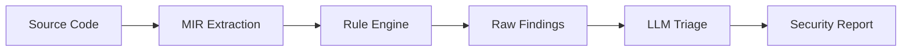
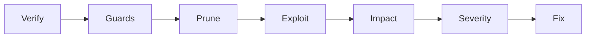

# Rust-cola

Experimental security analyzer for Rust exploring two ideas:

1. **MIR as analysis target.** Analyze after macro expansion, type resolution, and borrow checking. Rust's safety guarantees become explicit in MIR, making violations detectable.
2. **LLM-assisted triage.** A rules engine exhaustively finds patterns; LLMs assess exploitability and suggest fixes.



```
Source Code -> MIR Extraction -> Rule Engine -> Raw Findings -> LLM Triage -> Security Report
```

The LLM triage step applies a structured analysis workflow:



```
Verify -> Guards -> Prune -> Exploit -> Impact -> Severity -> Fix
```

**Note:** Requires nightly Rust. Target code must compile to extract MIR.

It's not a complete product. It's functional as a rules engine that finds vulnerable patterns, but precision varies by rule. See the [Rule Development Guide](docs/RULE_DEVELOPMENT_GUIDE.md) for how to improve individual rules.

## Installation

```bash
rustup toolchain install nightly
git clone https://github.com/Opus-the-penguin/Rust-cola.git
cd Rust-cola
cargo build --release
```

Binary: `target/release/cargo-cola`

**Linux only:** Requires OpenSSL development libraries (`libssl-dev` on Debian/Ubuntu, `openssl-devel` on Fedora/RHEL). macOS and Windows use native TLS and need no extra dependencies.

> **Note:** The `examples/` directory contains intentionally vulnerable code patterns for testing Rust-COLA's detection capabilities. These crates may have unmaintained or vulnerable dependencies by design and are not part of the distributed tool.

## Usage

### Recommended: LLM-assisted analysis

Rust-cola works best with an LLM. The LLM helps filter false positives, rate severity, and suggest fixes.

**Manual Workflow (Recommended):**

1. Run the scan on your target project:
   ```bash
   cargo-cola --crate-path /path/to/project
   ```

2. Point your LLM at `out/cola/llm-prompt.md`:
   - **VS Code + Copilot:** Reference the file in chat
   - **Claude/ChatGPT:** Upload or paste the file contents

3. The prompt tells the LLM to save its report to `out/cola/security-report.md`.

**Automated (experimental):** There's also `--llm-endpoint` and `--llm-model` flags to call an LLM API directly, but the manual workflow above is more reliable.

### Standalone (no LLM)

```bash
cargo-cola --crate-path . --report out/cola/raw-report.md
```

Generates a raw report with heuristic triage. Useful when LLM access is unavailable, but requires manual review of findings.

## Output Artifacts

By default, all artifacts are written to `out/cola/` **relative to your current working directory** (not the target crate):

| File | Description |
|------|-------------|
| `manifest.json` | Metadata and paths for all generated artifacts |
| `mir.json` | MIR extraction (functions, blocks, statements) |
| `ast.json` | AST extraction (modules, functions, structs) |
| `hir.json` | HIR extraction for researchers (optional, requires `--features hir-driver`) |
| `raw-findings.json` | Raw findings from all rules (pre-LLM validation) |
| `raw-findings.sarif` | Raw SARIF 2.1.0 output with all findings (includes `codeContext` and `suppressions` for audit trail) |
| `raw-report.md` | Standalone report without LLM validation |
| `llm-prompt.md` | Prompt file for manual LLM submission |
| `report.md` | LLM-validated report (when `--llm-report` is used) |

**Raw vs Validated:** Files prefixed with `raw-` contain all findings before LLM analysis. Use these for deep investigation or when LLM access is unavailable. The LLM-validated outputs contain only confirmed findings with severity scores and remediation guidance.

Use `--no-ast` or `--no-llm-prompt` to suppress specific outputs.

If an output file already exists, a timestamped version is created to avoid overwriting.

## Rules

126 rules grouped by vulnerability category:

| Category | Rules | Examples |
|----------|-------|----------|
| **Memory Safety** | 24 | Transmute misuse, uninitialized memory, Box leaks, raw pointer escapes, slice safety, self-referential structs, returned refs to locals, UnsafeCell aliasing, lazy init poison, use-after-free |
| **Concurrency** | 21 | Mutex across await, blocking in async, Send/Sync violations, executor starvation, closure escaping refs, cancellation safety, async drop correctness, panic in Drop, task panic propagation |
| **Input Validation** | 15 | Env vars, stdin, unicode, deserialization, division by untrusted, timestamp overflow, binary deser, regex DoS, integer overflow, allocation size |
| **FFI** | 11 | Allocator mismatch, CString pointer misuse, packed fields, panic in FFI, WASM linear memory OOB, WASM host trust, WASM capability leaks |
| **Web Security** | 14 | TLS validation, CORS, cookies, passwords in logs, Content-Length, template injection, unsafe Send across async |
| **Injection** | 10 | SQL injection, command injection, path traversal, SSRF, log injection |
| **Resource Management** | 10 | File permissions, open options, infinite iterators, unbounded allocations |
| **Code Quality** | 9 | Dead stores, assertions, crate-wide allow, RefCell, commented code, unwrap in hot paths |
| **Cryptography** | 8 | Weak hashes (MD5/SHA1), weak ciphers, hardcoded keys, timing attacks, PRNG bias |
| **Supply Chain** | 4 | RUSTSEC advisories, yanked crates, auditable dependencies, proc-macro side effects |

### Detection Levels

Rules use different analysis techniques with varying precision:

| Level | Method | Precision | Example |
|-------|--------|-----------|---------|
| **Heuristic** | Pattern matching on MIR text | Good | `transmute`, `into_raw` |
| **Structural** | MIR statement/terminator analysis | Better | Mutex guard across await |
| **Dataflow** | Intra-function value tracking | High | Uninitialized memory use |
| **Interprocedural** | Cross-function taint tracking | Highest | SQL injection chains |

Current distribution:

| Level | Rules | Percentage |
|-------|-------|------------|
| Heuristic | 63 | 50% |
| Structural | 26 | 21% |
| Dataflow | 32 | 25% |
| Interprocedural | 5 | 4% |

Most rules are heuristic—they find patterns but may produce false positives. The LLM-assisted workflow helps triage these.

See the [Rule Development Guide](docs/RULE_DEVELOPMENT_GUIDE.md) for custom rules and YAML rulepacks.

## Interprocedural Analysis

Some rules (SQL injection, path traversal, SSRF, etc.) track data flow across function calls. This is memory-intensive on large codebases, so analysis has built-in limits configurable via YAML:

```bash
cargo-cola --config cargo-cola.yaml --crate-path .
```

**Example `cargo-cola.yaml`:**

```yaml
analysis:
  max_path_depth: 8          # Maximum call chain depth (default: 8)
  max_flows_per_source: 200  # Flows per source function (default: 200)
  max_visited: 1000          # Functions visited per exploration (default: 1000)
  max_total_flows: 5000      # Total inter-procedural flows (default: 5000)
  max_functions_for_ipa: 10000  # Skip IPA for crates larger than this (default: 10000)
```

See `examples/cargo-cola.yaml` for a complete example.

## Options

| Flag | Description |
|------|-------------|
| `--crate-path <PATH>` | Target crate or workspace (default: `.`) |
| `--out-dir <PATH>` | Output directory (default: `out/cola`) |
| `--config <PATH>` | Path to configuration file (YAML format) |
| `--report <PATH>` | Generate standalone heuristic report |
| `--sarif <PATH>` | Custom SARIF output path |
| `--llm-prompt <PATH>` | Path for LLM prompt file |
| `--llm-endpoint <URL>` | LLM API endpoint |
| `--llm-model <NAME>` | Model name (e.g., gpt-4, llama3) |
| `--exclude-tests <bool>` | Exclude test code (default: `true`) |
| `--with-audit` | Run cargo-audit to check dependencies |
| `--rulepack <PATH>` | Additional rules from YAML |
| `--rules` | Print loaded rule metadata |
| `--fail-on-findings <bool>` | Exit with code 1 when findings are produced (default: `true`) |

Run `cargo-cola --help` for the full list.

## Dependency Auditing

Use `--with-audit` to integrate with [cargo-audit](https://rustsec.org/) and check dependencies for known CVEs.

## Etymology

**cola** = **CO**de **L**exical **A**nalyzer. Also, cola removes rust.

## License

MIT

## Acknowledgments

This project would not exist without AI tools: Claude, ChatGPT, and GitHub Copilot. The human involved is a rusty C++ programmer with a systems engineering background—enough to guide the architecture and intent, but not enough to build this alone.

Please [file issues](https://github.com/Opus-the-penguin/Rust-cola/issues) with feedback or suggestions.

