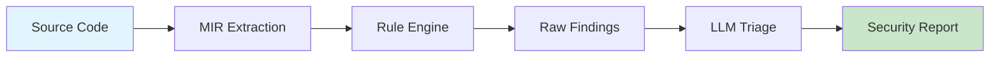
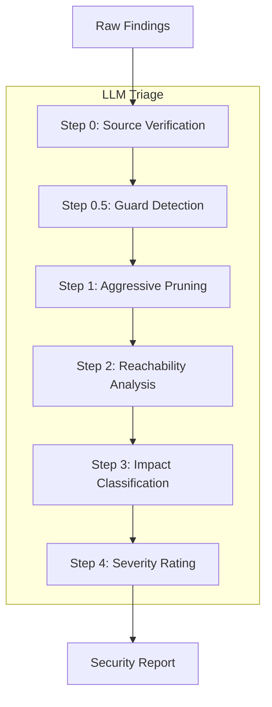

# Rust-cola User Guide

A concise guide to finding security bugs in Rust code.

---

## Table of Contents

1. [How It Works](#how-it-works)
2. [Quick Start](#quick-start)
3. [Understanding Output](#understanding-output)
4. [LLM Integration](#llm-integration)
5. [CI/CD Integration](#cicd-integration)
6. [Configuration](#configuration)
7. [Suppressing Findings](#suppressing-findings)
8. [Troubleshooting](#troubleshooting)

---

## How It Works

Rust-cola analyzes MIR (Mid-level Intermediate Representation), the compiler's internal format after macro expansion, type resolution, and borrow checking.



The optional LLM triage step applies a structured analysis workflow:



**Why MIR analysis matters:**

| Source Scanners | MIR Analysis |
|-----------------|--------------|
| See macro invocations | See expanded code |
| Guess at types | Know exact types |
| Miss trait dispatch | Resolve all calls |
| Local analysis only | Interprocedural taint tracking |

The tradeoff: your code must compile. No compilation = no MIR = no analysis.

### Detection Levels

Rules operate at different sophistication levels:

| Level | Method | Precision | Example |
|-------|--------|-----------|---------|
| **Heuristic** | Pattern matching on MIR text | Good | `transmute`, `into_raw` |
| **Structural** | MIR statement/terminator analysis | Better | Mutex guard across await |
| **Dataflow** | Intra-function value tracking | High | Uninitialized memory use |
| **Interprocedural** | Cross-function taint tracking | Highest | SQL injection chains |

Five rules use full interprocedural analysis: SQL injection, path traversal, SSRF, YAML injection, and command injection.

---

## Quick Start

### Installation

```bash
rustup toolchain install nightly
git clone https://github.com/Opus-the-penguin/Rust-cola.git
cd Rust-cola
cargo build --release
```

Add to your PATH:
```bash
export PATH="$PATH:/path/to/Rust-cola/target/release"
```

### First Scan

```bash
cd /path/to/your-project
cargo-cola
```

That's it. Results land in `out/cola/` (relative to your current directory).

**Tip:** To output alongside your target crate:
```bash
cargo-cola --crate-path ./my-crate --out-dir ./my-crate/out/cola
```

**Inspect available rules:**
```bash
cargo-cola --rules
```
Prints the live rule inventory (including loaded rulepacks) so you know exactly what checks will run.

### Test/Example Code Filtering

By default, rust-cola excludes findings from test, example, and benchmark code to reduce noise:

| Flag | Default | Description |
|------|---------|-------------|
| `--exclude-tests` | `true` | Exclude `tests/`, `#[test]`, `#[cfg(test)]` modules |
| `--exclude-examples` | `true` | Exclude `examples/` directory |
| `--exclude-benches` | `true` | Exclude `benches/` directory |

To include test code findings (e.g., for training or auditing):
```bash
cargo-cola --exclude-tests=false
```

To include all code contexts:
```bash
cargo-cola --exclude-tests=false --exclude-examples=false --exclude-benches=false
```

**Important:** The `raw-findings.sarif` file always contains **all findings** regardless of exclusion flags, with each finding annotated by its `codeContext` (production, test, example, benchmark). Non-production findings are marked with SARIF `suppressions` for tool compatibility. This preserves a complete audit trail while keeping reports focused on actionable production issues.

---

## Understanding Output

### Generated Files

```
out/cola/
├── manifest.json       # Metadata for all outputs
├── mir.json            # Extracted MIR (for debugging)
├── ast.json            # Extracted AST
├── raw-findings.json   # All findings (JSON)
├── raw-findings.sarif  # All findings (SARIF 2.1.0)
├── raw-report.md       # Standalone report
└── llm-prompt.md       # Prompt for LLM analysis
```

### Reading raw-findings.sarif

SARIF is the standard format for static analysis. Open in VS Code with the SARIF Viewer extension, or parse the JSON:

```json
{
  "runs": [{
    "results": [{
      "ruleId": "RUSTCOLA087",
      "message": { "text": "SQL injection: tainted data reaches query" },
      "level": "error",
      "locations": [{ "physicalLocation": { "artifactLocation": { "uri": "src/db.rs" }, "region": { "startLine": 42 }}}]
    }]
  }]
}
```

### Reading llm-prompt.md

This file is designed for LLM consumption. It contains:

1. **Pruning instructions** — How to filter false positives
2. **Reachability matrix** — Whether findings are in production code paths
3. **Impact taxonomy** — Business impact categories
4. **Contextual severity** — Factors that increase/decrease severity
5. **Remediation requirements** — What the fix should include
6. **Findings** — The actual findings with MIR context
7. **Output format** — Expected structure for the report

Copy this entire file into Claude, ChatGPT, or your preferred LLM.

**Adding context:** For better results, append relevant documents after the prompt: threat models, architecture diagrams, deployment context, or trusted boundary definitions. The more context the LLM has about your system, the better it can assess severity and filter false positives.

---

## LLM Integration

Rust-cola is designed for LLM-assisted analysis. Raw findings have false positives—the LLM filters them.

### Option 1: Manual Workflow (Recommended)

```bash
cargo-cola --crate-path .
```

Then point your LLM at `out/cola/llm-prompt.md`:
- **VS Code + Copilot:** Reference the file in chat
- **Claude/ChatGPT:** Upload or paste the file contents

The prompt tells the LLM to save its report to `out/cola/security-report.md`.

### Option 2: API Integration (Experimental)

There are `--llm-endpoint`, `--llm-model`, `--llm-temperature`, and `--llm-report` flags for direct API integration, but the manual workflow is more reliable. Set `RUSTCOLA_LLM_API_KEY` environment variable for authentication. Lower temperatures (close to 0.0) keep results deterministic; higher values allow more creative summaries.

### What the LLM Does

| Task | Description |
|------|-------------|
| **Filter FPs** | Dismiss findings that aren't real vulnerabilities |
| **Assess reachability** | Is this code actually called in production? |
| **Rate severity** | Critical/High/Medium/Low with justification |
| **Explain impact** | What could an attacker do? |
| **Suggest fixes** | Concrete code changes |

---

## CI/CD Integration

Run cargo-cola on every commit to catch issues early. Optionally upload SARIF results to GitHub's Security tab for visibility in pull requests.

### GitHub Actions

```yaml
name: Security Scan
on: [push, pull_request]

jobs:
  rust-cola:
    runs-on: ubuntu-latest
    steps:
      - uses: actions/checkout@v4
      
      - name: Install Rust
        uses: dtolnay/rust-toolchain@master
        with:
          toolchain: nightly
      
      - name: Build Rust-cola
        run: |
          git clone https://github.com/Opus-the-penguin/Rust-cola.git /tmp/rust-cola
          cd /tmp/rust-cola && cargo build --release
      
      - name: Run scan
        run: /tmp/rust-cola/target/release/cargo-cola --crate-path . --fail-on-findings true
      
      - name: Upload SARIF
        uses: github/codeql-action/upload-sarif@v3
        with:
          sarif_file: out/cola/raw-findings.sarif
```

### Exit Codes

| Code | Meaning |
|------|---------|
| 0 | No findings (or `--fail-on-findings false`) |
| 1 | Findings detected |

### Pre-commit Hook

```bash
#!/bin/sh
# .git/hooks/pre-commit
cargo-cola --crate-path . --fail-on-findings true --no-llm-prompt
```

---

## Configuration

cargo-cola works without configuration. The `cargo-cola.yaml` file is optional and only needed to customize analysis limits.

**Analysis limits** control how far interprocedural taint tracking explores. Deeper/wider exploration catches more issues but uses more memory and time. The defaults work for most projects. For very large codebases, you may need to reduce limits to avoid running out of memory.

Create `cargo-cola.yaml` in your project root to override defaults:

```yaml
analysis:
  # Interprocedural analysis limits
  max_path_depth: 8           # Call chain depth (default: 8)
  max_flows_per_source: 200   # Flows per taint source (default: 200)
  max_visited: 1000           # Functions per exploration (default: 1000)
  max_total_flows: 5000       # Total flows tracked (default: 5000)
  max_functions_for_ipa: 10000  # Skip IPA for huge crates (default: 10000)
```

Run with config:
```bash
cargo-cola --config cargo-cola.yaml --crate-path .
```

---

## Suppressing Findings

### Inline Suppression

```rust
fn dangerous_but_intentional() {
    // rust-cola:ignore RUSTCOLA001
    let raw = Box::into_raw(boxed);
    
    // rust-cola:ignore
    unsafe { do_something_scary(); }
}
```

### Rulepack Suppression

Suppress specific rules via rulepack:

```yaml
# my-suppressions.yaml
suppressions:
  - rule_id: RUSTCOLA042
    reason: "Cookie security handled at load balancer"
  - rule_id: RUSTCOLA043
    file: "**/tests/**"
    reason: "Test code"
```

```bash
cargo-cola --rulepack my-suppressions.yaml --crate-path .
```

---

## Troubleshooting

### "Error: failed to compile"

Rust-cola requires your code to compile. Fix compilation errors first:
```bash
cargo check
```

### "Error: nightly toolchain required"

```bash
rustup toolchain install nightly
rustup override set nightly  # in your project directory
```

### "Out of memory on large codebase"

Reduce interprocedural analysis limits:
```yaml
# cargo-cola.yaml
analysis:
  max_functions_for_ipa: 5000
  max_total_flows: 1000
```

Or skip IPA entirely with `max_functions_for_ipa: 0`.

### "Too many false positives"

1. Use LLM analysis — it filters most FPs
2. Suppress known-good patterns via rulepacks
3. Report persistent FPs: [GitHub Issues](https://github.com/Opus-the-penguin/Rust-cola/issues)

### "Finding doesn't make sense"

Check `mir.json` to see the actual MIR being analyzed. Macros often generate surprising code.

### "SARIF not uploading to GitHub"

Ensure the SARIF file exists and the path is correct. GitHub limits SARIF to 10MB.

---

## Further Reading

- [Rule Development Guide](RULE_DEVELOPMENT_GUIDE.md) — Create custom rules
